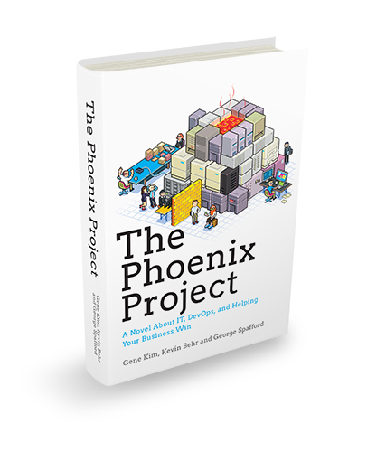
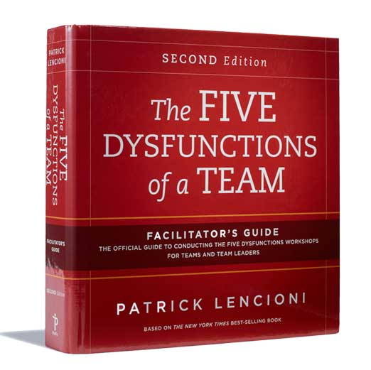
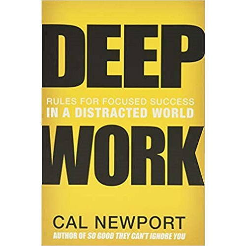
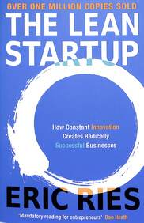
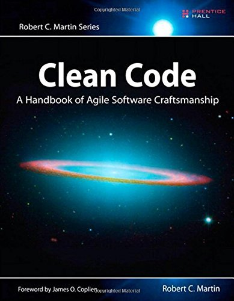
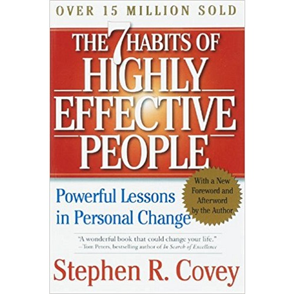

# Week 01 — Success Mindset (Mindset OS)

Part of the DevOps Micro Internship (DMI) with Agentic AI

---

## Purpose (Read This First)

This week is not motivation homework.

This is you building your **Mindset OS** — the system you will use for the next 5 months (and honestly, for years).

### Expectations

* Be honest.
* Be specific.
* Be practical.
* Write like an adult professional: clear sentences, no one-liners.

You will reuse this in later weeks. So do it properly once.

---

# Assignment 1. What is something you believe to be true that most people around you would disagree with?

### Rules

* No "safe" answers.
* Must be your real belief (not copied from internet).
* Minimum 50 words.

**Hint:** What do you believe about career, money, learning, discipline, relationships, health, success, life, tech industry, etc. that most people don't agree with?

## Answer

I feel that true success is not only about having talent or working hard. It also depends on a person’s character, consistency, and the way they treat others. Achieving results is important, but I believe qualities like good communication, empathy, and honesty are what help a person maintain success in the long run.

I have also learned that facing failures or setbacks does not always mean that we have chosen the wrong path. Sometimes, difficult experiences teach us valuable lessons, make us stronger, build our character, and prepare us for bigger responsibilities in the future. Because of this, I try to keep learning from my experiences, work on improving myself, and treat everyone with respect, even when things do not happen according to my expectations.

---

# Assignment 2. What are the top 3 objective truths you discovered through experimentation and results?

### Definition

Objective truths do not depend on opinions. They hold true regardless of how people feel.

Write each truth in this format:

**Truth:** (1 sentence)

**Evidence from my life:** (2–4 lines: what you tried + what happened)

---

## Truth #1

### Truth

Clear communication prevents more problems than assumptions ever solve.

### Evidence from my life

During my time working as a Project Coordinator and Executive Virtual Assistant, I realized how important proactive communication is for successful teamwork. Regularly staying in touch with clients, team members, and other stakeholders helped projects progress efficiently and prevented unnecessary confusion. I also had a personal experience in an earlier role where a lack of proper communication resulted in my employment being terminated unexpectedly, without any prior conversation. This taught me an important lesson about the value of being open, clear, and timely when communicating, especially when working with others or taking on leadership responsibilities.

---

## Truth #2

### Truth

Consistency produces better long term results than occasional bursts of motivation.

### Evidence from my life

Managing my software engineering studies along with project management responsibilities and my own learning journey taught me an important lesson: small, consistent efforts matter more than waiting for motivation. I found that making progress every day, even if it was just a little, helped me move forward. Whether I was completing my coursework, improving my portfolio, or working toward certifications, staying consistent gradually built both my skills and my confidence. Even during challenging periods, continuing to put in the effort helped me see real improvement over time.

---

## Truth #3

### Truth

I believe that every difficult experience has something to teach us. When I take time to understand what went wrong instead of reacting immediately, I can learn from it and make better decisions in the future.

### Evidence from my life

Losing a job that was important to me was a difficult experience, but instead of allowing it to make me negative, I took some time to think about what I could learn from it. It changed the way I look at leadership, feedback, and working with a team. Since then, I have understood the importance of being open in communication, making expectations clear from the beginning, and treating people with understanding and empathy. These lessons are something I want to carry with me throughout my professional career.

---

# Assignment 3. What does your 2.0 version look like?

### Instructions

Write as if a journalist is writing about you 3 to 7 years from now (not 20 years).

Minimum 300 words.

### Rules

* Write in past tense, like it already happened.
* Don't use "likes to / wants to / hopes to."
* Use specifics:

  * built
  * shipped
  * led
  * published
  * earned
  * relocated
  * contributed
* Include skills proof:

  * projects
  * portfolios
  * GitHub
  * blogs
  * certifications
  * job role
  * leadership
  * community contribution
* Add 1–3 images if you can (optional but powerful).

### Publish It Publicly On Any ONE

* LinkedIn
* Medium
* WordPress
* Blogspot
* Personal blog
* Portfolio page

Use the credit note that matches your track:

Add the following credit note at the end of your post **(If you are DMI Cohort 3 student)**:

> **P.S. This post is part of the DevOps Micro Internship (DMI) with Agentic AI — Cohort 3 — by [Pravin Mishra](https://www.linkedin.com/in/pravin-mishra-aws-trainer/). My graded progress is public: https://dmi.pravinmishra.com/s/YOUR-GITHUB-USERNAME.html · Start your DevOps journey: https://dmi.pravinmishra.com/?utm_source=student&utm_medium=ps-blog&utm_campaign=cohort3**

**Tag [Pravin Mishra](https://www.linkedin.com/in/pravin-mishra-aws-trainer/) in your LinkedIn post, then tag Lead Co-Mentor — [Anjana Muthunayake](https://www.linkedin.com/in/anjana-muthunayake/).**

Add the following credit note at the end of your post **(If you are DMI Self-paced track student)**:

> **P.S. This post is part of the DevOps Micro Internship (DMI) — Self-Paced Engineer Track — by [Pravin Mishra](https://www.linkedin.com/in/pravin-mishra-aws-trainer/). My graded progress is public: https://dmi.pravinmishra.com/s/YOUR-GITHUB-USERNAME.html · Start your DevOps journey: https://dmi.pravinmishra.com/?utm_source=student&utm_medium=ps-blog&utm_campaign=self-paced**

Add the following credit note at the end of your post **(If you are DMI Campus student)**:

> **P.S. This post is part of the DevOps Micro Internship (DMI) — Campus — by [Pravin Mishra](https://www.linkedin.com/in/pravin-mishra-aws-trainer/). My graded progress is public: https://dmi.pravinmishra.com/s/YOUR-GITHUB-USERNAME.html · Start your DevOps journey: https://dmi.pravinmishra.com/?utm_source=student&utm_medium=ps-blog&utm_campaign=campus**

**Tag [Pravin Mishra](https://www.linkedin.com/in/pravin-mishra-aws-trainer/) in your LinkedIn post, then tag Lead Co-Mentor — [Anjana Muthunayake](https://www.linkedin.com/in/anjana-muthunayake/).**

Hashtags:

#DMIByPravinMishra #AgenticAI #DevOps

## Your Article

**What Does My 2.0 Version Look Like?**

Four years ago, I made a decision that slowly changed the direction of my career. Instead of letting challenges and setbacks stop me, I decided to focus on learning, discipline, and consistent progress. Looking back, that mindset has become one of the most important parts of my journey.

Today, I am working toward becoming a Software Engineer and DevOps professional. My journey from being a Computer Science and Technology student to gaining practical experience in software development and DevOps has been a step-by-step process.

While completing my B.Tech, I focused on improving my technical skills through projects, assignments, certifications, and online learning. My experience with the DevOps Micro Internship helped me understand important concepts such as networking, Git, GitHub, Linux, automation, and deployment.

I also started using GitHub not just for storing code, but as a record of my learning, projects, documentation, and experiments. Writing about what I learned helped me understand concepts better and also gave me an opportunity to share my experiences with other beginners.

Along the way, I realized that technical skills are only one part of professional growth. Communication, teamwork, problem-solving, leadership, and the ability to accept feedback are equally important. Every project and challenge taught me something new about taking responsibility and working with others.

I also became interested in helping beginners understand technical topics in a simple way. Sharing my learning journey has become another way for me to grow.

My journey has not been perfect, and there have been setbacks. But each challenge taught me to reflect, improve, and keep moving forward.

My 2.0 version is not about becoming perfect. It is about becoming better than who I was yesterday.

For me, success is built through small efforts repeated consistently — learning a skill, completing a project, improving my GitHub, accepting feedback, helping others, and continuing even when progress feels slow.

**The journey is still going on, and I am still learning.**

P.S. This post is part of the DevOps Micro Internship (DMI) — Self-Paced Engineer Track — by Pravin Mishra. My graded progress is public: https://dmi.pravinmishra.com/s/sudipbhalla.html · Start your DevOps journey: https://dmi.pravinmishra.com/?utm_source=student&utm_medium=ps-blog&utm_campaign=self-paced

### Public Link

Paste your link here:

`https://www.linkedin.com/posts/sudip-bhalla-40521b380_dmi-devops-micro-internship-with-agentic-activity-7505682020019339264-DCYA?utm_source=share&utm_medium=member_desktop&rcm=ACoAAF4BNYUBkAldpXsIN4TAqTkoryo8S05tUFQ`

---

# Assignment 4. Have you ever cut corners (unethical / dishonest / shortcut behavior — not necessarily illegal)? If yes, how did it make you feel?

### Important

You don't need to write the full story.

Focus on the feeling:

* guilt
* fear
* shame
* stress
* regret
* numbness
* etc.

This is about self-awareness, not judgment.

### Answer Format

**Yes / No**

If Yes:

**What emotion did you feel?** (minimum 50–100 words)

## Answer

There have been situations where things did not turn out the way I had expected, and I found myself reconsidering the choices I had made. Instead of simply blaming the circumstances, I took time to look at my own actions. I asked myself whether clearer communication, earlier questions, or a different approach could have led to a better result. These experiences taught me to reflect honestly and use each outcome as an opportunity to improve my future decisions.

---

# Assignment 5. What are 10 non-fiction books you plan to read in the next 1 year?

### Rules

* Mention **Title + Author**
* Any language allowed
* No fiction novels

### Tip

Choose books that improve:

* mindset
* communication
* productivity
* health
* money
* career
* leadership

## Book List

1. The Power of Focus for Women - Fran Hewitt & Les Hewitt

2. The Phoenix Project — Gene Kim, Kevin Behr & George Spafford

3. The Five Dysfunctions of a Team — Patrick Lencioni

4. Deep Work — Cal Newport

5. The Lean Startup — Eric Ries

6. Clean Code — Robert C. Martin

7. The Psychology of Money — Morgan Housel

8. Crucial Conversations — Kerry Patterson, Joseph Grenny, Ron McMillan & Al Switzler

9. The 7 Habits of Highly Effective People — Stephen R. Covey

10. Secret the Power - Rhonda Byrne

---

# Assignment 6. What are the things you will measure regularly in your life and career?

### Rules

List topics only. No need to share numbers.

### Must Include

* Learning / skill
* Output / proof
* Health / energy
* Time / focus
* Money / finance (personal or business)

### Example

* Learning hours per week
* Deep work sessions per week
* Projects shipped / documented
* Steps / workouts
* Sleep hours
* Spending tracker

## My Metrics

* Learn a skill and polish it with practice.
* Projects completed and documented
* Personal skill development (communication skills , knowledge base)
* Coursework progress and assignment completion
* Sleep quality and hours of rest
* Physical and emotional well-being (exercise, prayer, reflection, and stress management)
* Play some outdoor games or online games for stress relif.

---

# Assignment 7. Brain Dump + 5-Month System Plan

## Step 1: Brain Dump (Private)

Do a brain dump of everything in your mind into a notebook.

Examples:

* Bills
* Tasks
* Worries
* Goals
* Pending messages
* Ideas
* Responsibilities

### Did You Do It?

**Yes / No**

Answer:

I wrote down everything that was on my mind, from college work and DevOps internship tasks to job applications, portfolio updates, GitHub projects, certifications, financial matters, family responsibilities, prayers, unanswered messages, content ideas, career plans, and personal growth. Putting all of these thoughts on paper helped me clear my head and see my priorities more clearly. Instead of trying to keep track of everything mentally, I could focus on the things that were actually important and needed my attention.

---

## Step 2: Your 5-Month Routine + Focus Blocks

Create a simple plan you can realistically follow for the next 5 months.

### Weekly Routine

Example:

* Mon–Thu: 60 min deep work
* Sat: DMI session
* Sun: Weekly review

#### My Weekly Routine

### Weekly Learning and Career Routine

**Monday–Thursday: 2 Hours of Focused Technical Work**
**7:00–9:00 PM**

During these four days, I will concentrate on one main technical area at a time, such as **Android Development**.

My approach will be simple:

**Learn → Build → Review → Move Forward**

I will first use tutorials or learning resources to understand the concept, then apply what I learned by building something based on my planned design. After completing each part, I will review my work, identify areas that need improvement, and then move on to the next topic or feature. The main focus will be practical learning rather than only watching tutorials.

**Saturday: 30–45 Minutes for Job Preparation**
**2:00–3:45 PM**

Saturday will be dedicated to improving my job-readiness. I will rotate between:

* Aptitude practice
* Verbal communication
* Reading books aloud

The purpose is not just to prepare for interviews, but to become better at expressing technical ideas clearly and confidently. I want to be able to communicate my engineering knowledge, not just understand it myself.

**Sunday: 1.5–2 Hours — DMI and Project Work**
**Preferably afternoon/evening**

I will divide this time between DMI learning and practical project work:

* **1 hour:** Complete DMI learning and assignments
* **30–60 minutes:** Apply the concepts to my own project

I will treat DMI as more than just a certification requirement. After every session, I will try to take at least one useful concept and apply it to something I am actually building.

**Sunday: 6:00–8:00 PM — Professional Community Work**

I will use this time to maintain my professional presence by:

* Publishing LinkedIn posts
* Updating my GitHub portfolio
* Documenting projects and learning progress

**Sunday: 30-Minute Weekly Review**

At the end of each week, I will spend around 30 minutes reviewing what I completed, what I learned, what went wrong, and what needs more attention in the coming week. This will help me stay organized and make small improvements to my routine instead of repeating the same mistakes.

---

### Focus Blocks

#### When Will You Do DMI Work? (Days + Time)

Tuesday, Thursday, Saturday, and Sunday evenings (6:00 PM – 8:00 PM)

#### How Many Sessions Per Week?

One live session and 4 focused sessions per week

---

### Distraction Rules

Examples:

* Phone rules
* Social media rules
* Environment setup

#### My Distraction Rules

Keep my phone on Do Not Disturb during deep work sessions.
Check WhatsApp and social media only during scheduled breaks.
Avoid comparing my career journey with other people's progress.
Work from a clean and organized study environment.
Focus on completing one task before starting another.
Review my priorities every morning instead of reacting to distractions.
Protect my peace by limiting activities that trigger unnecessary self-doubt.

---

# Reflection – Week 1

### Biggest insight I got about myself this week

I have come to understand that my biggest challenge is not whether I am capable, but how I respond when things do not go as planned. Disappointment and uncertainty can easily take away my focus if I allow them to. However, difficult experiences have helped me grow and taught me that staying consistent, keeping faith, and taking action every day are more important than waiting for everything to be perfect. I believe my future will depend on the habits and systems I create, not on the setbacks I have faced.

### My biggest weakness/loop I noticed

I have noticed that I sometimes imagine the final result before I even begin the actual work, and when things do not turn out the way I expected, I end up feeling disappointed. Another weakness I have identified is that I can spend too much time planning instead of taking action. I may create a detailed plan, but the difficult part is actually starting and consistently following through. I am learning that good planning only matters when I turn those plans into real action.

### One system I will implement from this week (exact habit + time)

Not just thinking, executing the plans.

### LinkedIn Post
Paste your LinkedIn post link here.

`https://www.linkedin.com/posts/sudip-bhalla-40521b380_dmi-devops-micro-internship-with-agentic-activity-7507092836035751937-49qA?utm_source=share&utm_medium=member_desktop&rcm=ACoAAF4BNYUBkAldpXsIN4TAqTkoryo8S05tUFQ`

---

## 10. Proof of Work

- LinkedIn Post URL:https://lnkd.in/p/dPvm9_W6
- Blog / Medium : https://medium.com/@bhallasudip0974/my-biggest-problem-isnt-planning-it-s-execution-10182095b24e

---

## 📌 About DMI & CloudAdvisory

DevOps Micro Internship (DMI) is a project-based DevOps program run by Pravin Mishra (The CloudAdvisory) focused on real-world execution, systems thinking, and career readiness.

It helps learners build strong DevOps foundations with hands-on experience.

## 📌 Resources

- 🌐 **DMI Official Website:** https://dmi.pravinmishra.com?utm_source=github&utm_medium=readme  
- 🎓 **University:** https://university.pravinmishra.com?utm_source=github&utm_medium=readme  
- 💬 **Discord Community:** https://discord.pravinmishra.com?utm_source=github&utm_medium=readme  
- 📝 **Blog:** https://dmi.pravinmishra.com/blog?utm_source=github&utm_medium=readme  
- ▶️ **YouTube Playlist (DMI Cohort 3):** https://www.youtube.com/playlist?list=PLFeSNDtI4Cho  
- 🔗 **Pravin Mishra (LinkedIn):** https://www.linkedin.com/in/pravin-mishra-aws-trainer/  
- 🏢 **CloudAdvisory (LinkedIn):** https://www.linkedin.com/company/thecloudadvisory/

---

*This submission is part of DevOps Micro Internship (DMI) — Agentic AI Track*